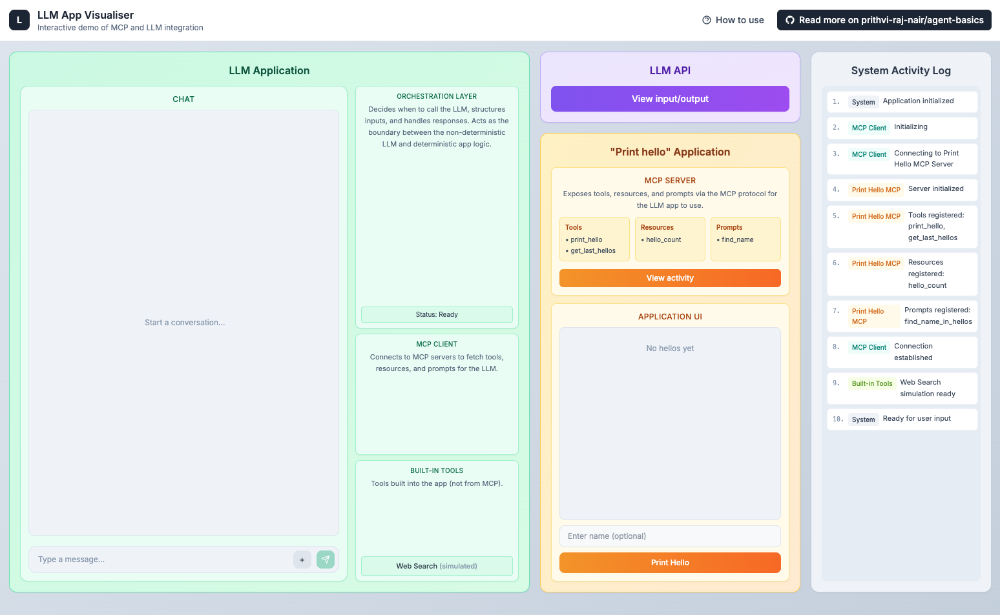

# LLM App Visualiser

An interactive web app that visualises how an LLM application works, including the Model Context Protocol (MCP) for tool integration.

**Live demo:** [llm-app-mcp-visualisation.vercel.app](https://llm-app-mcp-visualisation.vercel.app/)

## Pre-requisites

To get the most out of this visualisation, it helps to understand the concepts behind LLM applications. Check out these learning notes:

- [Basics of using LLMs in your app](../learning-notes/Basics%20of%20using%20LLMs%20in%20your%20app/Basics%20of%20using%20LLMs%20in%20your%20app.md)
- [Tool calling - Deep dive](../learning-notes/Tool%20calling%20-%20Deep%20dive/Tool%20calling%20-%20Deep%20dive.md)
- [Model Context Protocol (MCP)](../learning-notes/Model%20Context%20Protocol%20(MCP)/Model%20Context%20Protocol%20(MCP).md)

## How to Use

### Chatting and using tools

- Type into the LLM chat UI to send a message
- Use the **+** button to access tools, prompts and resources available to the LLM app
- Notice the UI for prompt templates - select one to see how parameters are filled in
- Try saying hi to different names and use the prompt template to find them

### LLM API calls visualisation

Click **View input/output** in the LLM API section to see the actual inputs and outputs for each LLM API call. This helps you understand how tool calling and responses are structured and managed.

### System activity log

The right panel shows a linear flow of events across the system. Read through it to understand how different components interact with each other in real-time.

### Interact with the "Print hello" app

The orange section simulates a third-party application connected via MCP. You can:

- Use the **Print Hello** button directly to add hellos
- Watch how manual interactions reflect in the tool calls made by the LLM
- Notice how the total count stays in sync whether hellos come from the UI or the LLM

### MCP server activity

Click **View activity** in the MCP Server section to see the inputs and outputs of tool calls made to the server.
